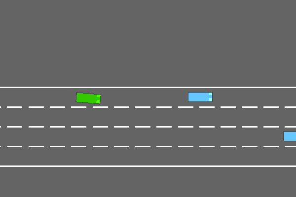
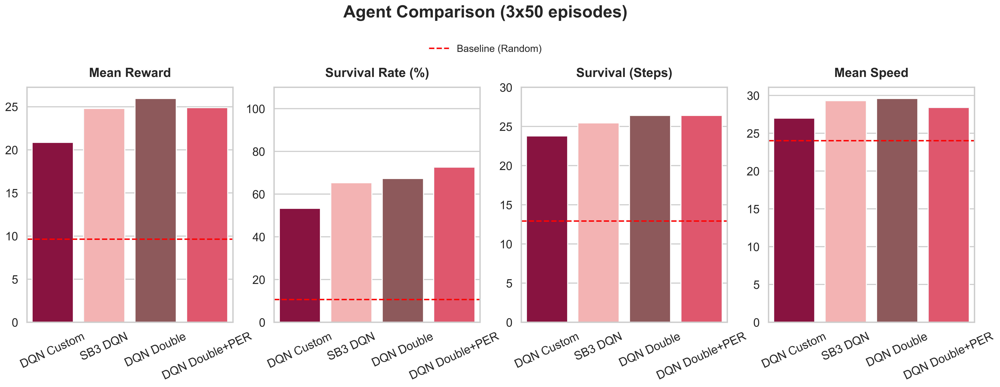

# Apprentissage par renforcement sur l'environnement Highway-v0 

Ce projet implémente et compare plusieurs agents d'Apprentissage par Renforcement de type DQN sur l'environnement `highway-v0`. L'objectif est de former un agent capable de naviguer dans le trafic en maximisant sa vitesse tout en évitant les collisions.

Ce dépôt inclut une implémentation "from scratch" en PyTorch, une implémentation via Stable-Baselines3 (SB3), ainsi que des extensions avancées (Double DQN et Prioritized Experience Replay - PER).

## Architecture du Projet

Le code est structuré pour séparer la logique des agents, des entraînements et de l'évaluation :

* `agents/` : Contient les classes des modèles (DQN Custom, SB3, PER, Random).
* `checkpoints/` : Stocke les poids des modèles et les logs TensorBoard.
* `dce_scripts/` : Contient des scripts utilisés pour entraîner les agents sur le DCE de CentraleSupélec.
* `training/` : Scripts d'entraînement. `unified_train.py` a été utilisé pour la partie commune (entraînement d'un DQN custom et avec SB3). Les autres scripts ont été utilisés pour l'ajout des extensions. Il contient également les codes relatifs à l'optimisation des paramètres via Optuna.
* `evaluation/` : Scripts pour évaluer (`run_eval.py`), générer les graphiques (`plot_eval.py`) et visualiser les différents agents (`test_agent.py`).
* `notebooks/` : Contient un notebook d'étude des runs.
* `results/` : Stocke le JSON des statistiques et les différentes figures et vidéos.
* `shared_core_config.py` : Configuration centrale de l'environnement de test pour garantir des comparaisons justes.

### Démonstrations

| Agent Aléatoire (Baseline) | Agent DQN Double + Per |
| :---: | :---: |
|  |  |

## Installation

1. Clonez ce dépôt.
2. Créez un environnement virtuel (recommandé) : 
    ```bash
    python -m venv env
    ```
3. Activez l'environnement et installez les dépendances requises :
    ```bash
    pip install -r requirements.txt
    ```
## Tutoriel d'Utilisation

### 1. Lancer un Entraînement
Plusieurs scripts sont disponibles dans le dossier `training/` selon l'architecture que vous souhaitez tester. Tous génèrent automatiquement leurs checkpoints et logs TensorBoard.

* **Méthode standard (DQN Custom & SB3)** :
  Utilise le script unifié, idéal pour comparer l'implémentation maison et la baseline SB3.
    ```bash
    python training/unified_train.py
    ```
* **Méthodes avancées (Extensions)** :
Pour reproduire les modèles finaux de l'étude avec les environnements vectorisés ou l'Experience Replay Priorisé (PER) :
    ```bash
    # Entraînement vectorisé (DQN Asynchrone)
    python training/train_dqn.py      

    # Entraînement avec Prioritized Experience Replay (PER)
    python training/train_dqn_per.py
    ```

Pour suivre l'apprentissage en temps réel d'un run lancé via `unified_train.py`, lancez tensorboard `--logdir checkpoints/` dans un autre terminal.

### 2. Visualiser les agents en action
Pour regarder un agent entraîné conduire sur l'autoroute, utilisez le script de test en spécifiant le nom de l'agent :

    python evaluation/test_agent.py --agent dqn_custom --episodes 3


Les arguments valides pour --agent sont : random, dqn_custom, sb3, dqn_double, dqn_per, dqn_double_per.

(Optionnel) Ajoutez le flag --save pour générer automatiquement un GIF de l'épisode dans le dossier results/.

### 3. Générer les statistiques et graphiques
Pour lancer le benchmark complet sur les différents modèles (sur 3 seeds différents) et générer le tableau de résultats récapitulatif :

    python evaluation/run_eval.py


Pour générer ou mettre à jour les graphiques de comparaison PNG dans le dossier results/plots/ à partir de l'évaluation :

    python evaluation/plot_eval.py


